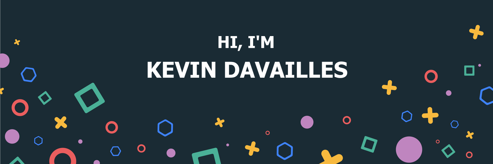

<h1 align="center">Hi, I'm Davailles Kevin</h1>
<h3 font-size="20" align="center">A passionate frontend/backend developer and a student from IUT at Le-Puy-En-Velay.</h3>

- 🌱 I’m currently learning **To be Extroverted** 
 
- 👨‍💻 All of my projects are available [@KevinDavail](https://github.com/KevinDavai)

- 💬 Ask me about **Astronomy & FrameWork Symfony 😆**

- ⚡ Fun fact **Coding is a passion and not profession.**
  

---

<h2 align="center"><u><b>Knowledge Base</b></u></h2>

<h3 align="center">Languages</h3>

  
  
    
  
  
  

<h3 align="center">Frontend</h3>

      
  
    

<h3 align="center">Backend</h3>

  
   
   
   

<h3 align="center">Database</h3>

  
   

<h3 align="center">Preferred IDEs  & Tools :</h3>

 
  
  
  

----

<h3 align="center">Connect with me</h3>

  

    
  

----

<h2 align="center" style="margin: 5px 10px;">Github stats:</h2> 

----

  

------
Credit: [KevinDavai](https://github.com/KevinDavai)

Last Edited on: 10/27/2021
